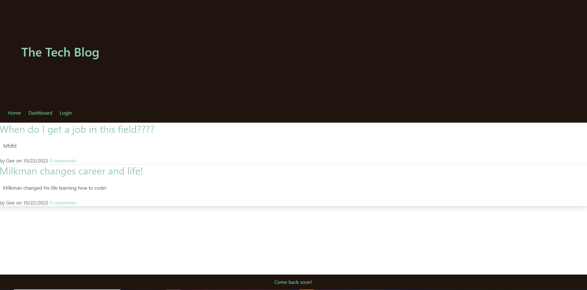

# cms-tech-blog

## Purpose 

The purpose of this application is to be able to blog with other techs. A user can post a blog and comment on other tech blogs!

## Built With

* JS

* CSS

* SQL

* NODE

* EXPRESS

* dotenv

* bcrypt

* Handlebars

## Usage

When a user reaches this app, they'll be able to see every post that anyone has posted. They won't be able to comment until they have made an account. Once they have made an acoount they'll have full access to the app, posting and commenting on other users posts.

## Example

## Link To Website

https://boiling-shore-70072.herokuapp.com/